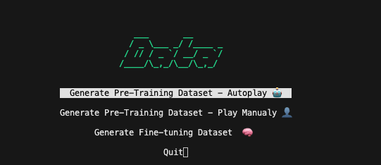

![[image.png]]

_____
> The overengineered snake game that nobody asked for

  
This is an experiment in using a transformer-based model to simulate Snake Game physics. This is not an AI that learns to *play* a game, this model *is* the game engine — it predicts the next board state given the current state and player input.


[Recording of the game]


It's slow, it's an overkill. It was fun to build.

This repo contains the code for the game, the training pipeline (see [Pre-Training](#pre-training)) and the data generation pipeline (see [Data Generation](#data-generation)). I'm also publishing the model weights in Huggingface so you can play it right away.

# Quickstart


1. **Clone the repo**
```bash
git clone https://github.com/mcrimi/snakeformer
cd snakeformer
```

2. **Set up a virtual environment and install requirements**
```bash
python -m venv venv
source venv/bin/activate  # On Windows use: venv\Scripts\activate
pip install -r requirements.txt
```

3. **Download the model weights and metadata from Hugging Face**

```bash
cd model/weights
python -c "from huggingface_hub import hf_hub_download; hf_hub_download(repo_id='mcrimi/snakeformer', filename='snake_model.pt', cache_dir='./'); hf_hub_download(repo_id='mcrimi/snakeformer', filename='meta.pkl', cache_dir='./')"
```
This will download `snake_model.pt` and `meta.pkl` into the (`model/weights`). directory

4. **Run the Game:**
```bash
python play.py
```

4. **Select Mode:**

- **SnakeFormer:** The model engine and load the model that you downloaded from Hugging Face

# How it works

## How It Works

The game board is represented as a 16x16 ASCII grid:

```
`................`
`................`
`................`
`................`
`................`
`................`
`................`
`................`
`................`
`................`
`................`
`........#.......`
`........O.......`
`........H......F`
`................`
`................`
```

Which can be represented with this vocabulary (16 tokens):

**Structural Tokens:**
- `B:` **Board State** prefix
- `A:` **Action** prefix (The player's input)
- `T:` **Target State** prefix (What the model *predicts* happens next)
- `:` Separator (used after B, A, T)
- `$` Stop token (end of sequence)
- `\n` Newline

**Direction Tokens:**
- `U` Up
- `D` Down
- `L` Left
- `R` Right

**Game Element Tokens:**
- `H` Snake Head
- `O` Snake Body segment
- `#` Snake Tail
- `F` Food
- `.` Empty space


**Game Condition Tokens:**
- `X` Death (Game Over)

The model receives a prompt like:
```
B:
[current board state]
A:R
T:
```

And generates the next board state after executing action `R` (Right).

On top of this model there is a TUI that showcases the ASCII in a nicer way. The TUI is also used for the deterministic version of the game.

# The Modules

## Data Generation

If you want to to train your own model model, you'll first need a gameplay dataset. The `dataset/data_gen.py` script gives you a couple of options on how to do this:

Run:
```bash
python3 dataset/data_gen.py
```



You have 3 options:

1. **Autoplay (Curriculum)**: A hard-coded heuristic bot plays thousands of games using varied heuristic strategies for representative sample coverage of the gamespace.
    - **Output**: `dataset/snake_data_curriculum.txt`
    - **Best for**: Generating the initial bulk pre-training dataset (~500k samples).

2. **Manual Play**: You play the game manually to demonstrate specific behaviors.
    - **Output**: `dataset/snake_data_curriculum.txt` (Appended to the same file)
    - **Best for**: Adding specific human-like moves or edge cases the autoplay bot misses.

This produces `dataset/snake_data_curriculum.txt`, which serves as the training corpus.

3. **DAgger (Fine-tuning)**: **Requires a pre-trained model.** The heuristic bot plays while the Neural Model "shadows" it in the background. When the Neural Model makes a prediction error (hallucination) compared to the bot's ground truth, we record that specific "hard example".
    - **Output**: `dataset/snake_curriculum_dagger_fixes.txt`
    - **Best for**: Creating a high-quality fine-tuning dataset to fix specific model weaknesses.


You also have a script to analyze the dataset for correctness and coverage of the gamespace. Run:
```bash
python dataset/analyze_dataset.py
```

## Pre-Training
Once the data is generated, you can train the Transformer model. The `training/train.py` script handles this. It's a standard PyTorch training loop that minimizes the cross-entropy loss between the predicted next character and the actual next character. See [Model Architecture](#model-architecture) for more details.

To train a fresh model:
```bash
python training/train.py pretrain --max_iters 20000 --batch_size 64
```

The script supports **Weights & Biases** logging if you want to track loss curves. You will need to provide your own API key for W&B.
```bash
python training/train.py pretrain --wandb
```
You can also use the interactive menu to select the type of training (pretrain, online, etc.) and other parameters. This is merely for pleasing aesthetic purposes of the author.


## Online Training
Ok, this I think it's cool. I've implemented an online training mechanism (implemented in `games/shadow_neural_snake.py`) that allows you to fine-tune the model *during gameplay*.

When playing in **Shadow Mode**, if the Model Engine output diverges from the deterministic Shadow Engine:
1. The game pauses.
2. **🚨 DIVERGENCE DETECTED 🚨** A divergence menu appears.
3. Press **'T'** to trigger an immediate training optimization step.

The game constructs a mini-batch consisting of the *exact* context that caused the error, combined with the *correct* next token from the Shadow Engine. It runs a backward pass to update the model weights, heavily penalizing the mistake.

**The Penalization Logic:**
- **Standard Error**: 1x Weight
- **Critical Error**: **50x Weight** (if the error involves Head `H`, Food `F`, or Death `X`)

This 50x multiplier forces the model to prioritize "keeping the snake alive" and "eating food" over merely getting the background dots correct. This might be an overkill, but it worked in my experiments. Feel free to tinke around.

After a few iterations, the model learns to correct its behavior and the game resumes. You can then save the enlightened model back to disk.


# Model Architecture

At the heart of this project is a small, bespoke Transformer model for reptiles.
  
- **Architecture**: Decoder-only Transformer (GPT)
- **Parameters**: ~0.8 Million 
- **Layers**: 4
- **Attention Heads**: 8
- **Embedding Dimension**: 128
- **Context Window**: 1024 tokens
- **Vocabulary Size**: ~20 characters (ASCII board elements + control tokens)

![[Snakeformer Readme 2026-01-27 18.31.16.excalidraw]]

```mermaid_text

graph TD
subgraph Inputs
I[Input Sequence] -->|Indices| TE[Token Embedding]
P[Positions] -->|0..T| PE[Position Embedding]
end
TE & PE --> Add((+))
Add --> B1[Transformer Block 1]
B1 --> B2[Transformer Block 2]
B2 --> B3[Transformer Block 3]
B3 --> B4[Transformer Block 4]
subgraph Block Structure [Internal Block Details]
direction TB
BZ[Input] --> LN1[LayerNorm]
LN1 --> MHA[Multi-Head Attention]
MHA --> ADD1((+))
BZ --> ADD1
ADD1 --> LN2[LayerNorm]
LN2 --> FFN[Feed Forward]
FFN --> ADD2((+))
ADD1 --> ADD2
ADD2 --> BO[Output]
end
B4 --> LN_F[LayerNorm Final]
LN_F --> LH[Linear Head]
LH --> SM[Softmax]
SM --> O[Next Token Probabilities]
style Inputs fill:#f9f,stroke:#333
style Block Structure fill:#eee,stroke:#333

```

# Learnings

## The Tail Problem

I initially didn't recognize the importance of clearly defining the snake's tail (`#`) as part of the board state. Why was that important?Becaue I formulated and engineerd inference as if we would be under Markovian Process, meaning that the next state depends **only on the current state**. This is impossible without clearly determining where the tale is

Take the following snake without explict tail:

```text
O H
O O
```

It is impossible to tell if the tail of the snake is to the left or below the head snake — that depends on how it got to be in that position.

When the model is unsure which segment to delete (the tail) in the next board state, it often deletes nothing to minimize loss, causing the snake to grow indefinitely.

Changing the tail character to a unique token (`T`) solves this instantly. It makes the state fully observable from a single frame, allowing the model to learn the simple rule: *"Find `#T` and turn it into `.`"*.

I could also have changed training and gamplay+inference to cater for longer context wiindows, but this did the trick alrady.


## Can randomness be learned?

I had an interesting problem with food spawning. Originally the game dynamics (and therefore the training) considered a random spawning of initial and new food. But then during training, the model was having a really hard time capturing this and I had to switch to a deterministic approach for food spawning, something that the model can learn.

The current deterministic spawning logic computes food position from the snake's head:

```python
target_r = (head[0] + 5) % game_height
target_c = (head[1] + 7) % game_width
# Then scans for first empty cell if position is occupied
```

The fundamental issue is that supervised learning requires a deterministic mapping from input to output. With random food spawning:

1. The same board state + action could produce many different next states (food appearing at any empty cell)
2. The model is trained with cross-entropy loss to predict the *most likely* next token
3. When faced with many equally valid outputs, the model either:
   - Averages probabilities across all valid food positions (predicting nothing confidently)
   - Overfits to specific examples (memorizing rather than generalizing)
   - Hallucinates "compromise" positions that don't match any training example (no food in the board)

**Could have I solved for this differently?**

Theoretically yes, but adding quite some complexity:

- Pass a random seed as input so the model can learn (board, action, seed) → next_state
- Use an architecture designed for multimodal outputs (VAEs, diffusion). Or at least this is what Claude Opus 4.5 told me. I would like to try that.


# Tech Stack

- **PyTorch**: The core deep learning framework used to build and train the Transformer model.
- **Curses**: The standard Python library used to create the retro, terminal-based user interface (TUI).
- **Weights & Biases**: Used for experiment tracking, visualizing loss curves, and monitoring training progress.
- **Pickle**: Used for efficient serialization of dataset metadata and vocabulary.


**Give it a spin!** If you manage to teach it to play a perfect game just by scolding it every time it cheats, let me know. 🚀

